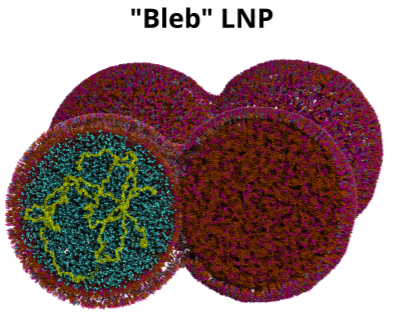

### Lipid Nanoparticle Construction

Here in you find the commands used for constructing the LNP systems studied in the [original paper](https://doi.org/10.26434/chemrxiv-2024-bf4n8).

Please be aware that we provide only **_guidelines_** for building LNP structures, **_NOT_** an automated protocol. 
The component ratios and structural details may need to be adjusted based on your specific scientific question. These adjustments often require manual (hardcoded) changes to the scripts.

#### Folder Inverse_Hexagonal_core_LNP: Contains the commands used for setting up an LNP with an inverse hexagonal core.  
Input files for the three LNPs simulated in the paper can also be found in this folder.

  

#### Folder Bleb_structure: Contains the commands used for constructing a 'Bleb' like LNP.  
Note that this is a showcase protocol not optimized to run Molecular Dynamics on the resulting structure.

  

