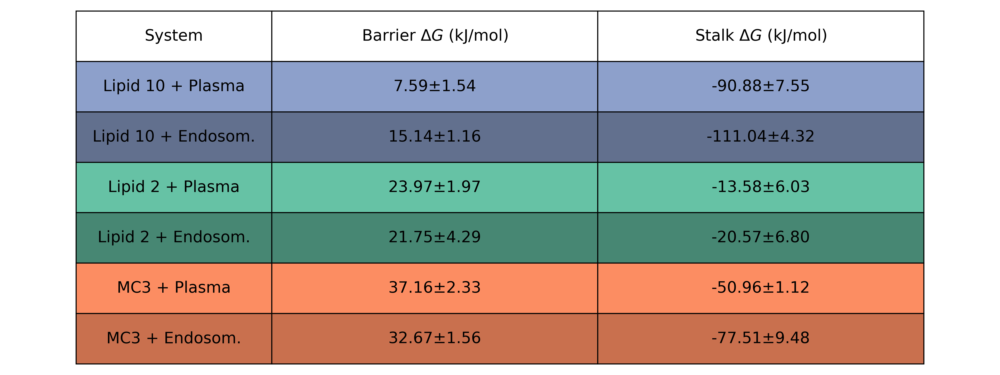

## Fusion assays

Bilayer fusion assays between LNP membranes with different ionizable lipids and a target plasma membrane were performed using the method described in [Poojari et al](https://www.nature.com/articles/s41467-021-26924-2).  

## LNP composition

For the LNP membrane we used the following ratios of 50:10:40 (ionizable lipid:DSPC:Cholesterol).
We used three different ILs: 

> **MC3:** parameters can be found on MC3_MC3H.itp (MC3H on insane) 

> **Lipid 2:** parameters can be found on LI2H.itp (LI2H on insane)

> **Lipid 10:** parameters can be found on LI10H.tip protonated (L1P on insane)

ILs Lipid 2 and Lipid 10 where first described in [Sabnis et al.](https://doi.org/10.1016/j.ymthe.2018.03.010), were a significant decrease in protein expression is seen when includinh Lipid 2 in the LNP, when compared to MC3. On the other hand, with Lipid 10 there is significant increase in the protein expression. This is indirectly related to the fusion propensity. 
Additionally we also tested the addition of different sterols, which can be found under the sterols folder. 

**Note:** Generally the naming goes name and name+H for neutral and charged respectively. 

## Endosomal membrane composition

We used a plasma membrane model by [Ingolfsson et. al](https://www.ncbi.nlm.nih.gov/pmc/articles/PMC7553384/), which has reduced complexity, but captures reasonably well the properties of more complex compositions. 
The is composed of (in mol\%):
> **LNP interacting leaflet of this membrane:** 24% POPC, 12% PAPC, 2% POPE, 6% DIPE, 24% DPSM and 31% CHOL;

> **Non-interacting leaflet contains:** 14% POPC, 8% PAPC, 5% POPE, 16% DIPE, 11% DPSM, 28% CHOL, 25% PAPS, 2% PAP6.

An additional membrane model, enriched with **_10 mol% PAPS_** lipids in the LNP-interacting leaflet, was also considered to better model the differences in composition in the endosome. 

## Protocol details

All bilayer fusion systems were built with the **_1 - Build_system.ipynb_** protocol, and the same protocol was used for all studies of these systems, differing only in the composition of the membranes. 

Initially, two independent membrane bilayers corresponding to the target LNP and endosomal target membrane are built using the [insane software](https://pubs.acs.org/doi/10.1021/acs.jctc.5b00209). Each system was then hydrated and neutralized using sodium ions. This was followed by energy minimization and equilibration for 20 ns to relax the box dimensions completely. 

Subsequently, the two membranes were stacked on top of each other. To fully hydrate the distal leaflets, the box was extended along the z-axis, and additional water was added to until there were **5 water beads per lipid** between the proximal leaflets. Sodium ions were introduced to neutralize the system's charge. The double membrane system was then equilibrated for an additional 20 ns.

To avoid waters from permeating the leaflets and changing the hydration of the inner layer, we applied **flat-bottomed position restraints** to all water beads. The reference positions of all flat-bottomed position restraints were taken as the center of the box along z.

The initial frames for the umbrella sampling (US) simulations were extracted from constant-velocity pulling simulations. In these simulations, the systems were pulled from [reaction chain coordinante](https://pubs.acs.org/doi/10.1021/acs.jctc.7b00106) reaction coordinate 0.25 to 1 over 1000\,ns using a **force constant of 5000 kJ/mol**, for five replicates (see **2 - Generate_initial_positions.ipynb**). 

Nineteen umbrella windows were employed, with reference positions ranging from 0.1 to 1 in increments of 0.05, where 1 is the fully formed stalk. The force constant was set to 5000 kJ/mol. Each window was simulated for 1 microsecond, with the initial 500ns excluded for equilibration. An integration time step of 20 fs was utilized (see **3 - Create_windows.ipynb**). 

The potential of mean force was computed using the weighted histogram analysis method (WHAM).

## PMF results
### Values for Fig 3C

### Values for Fig 4

