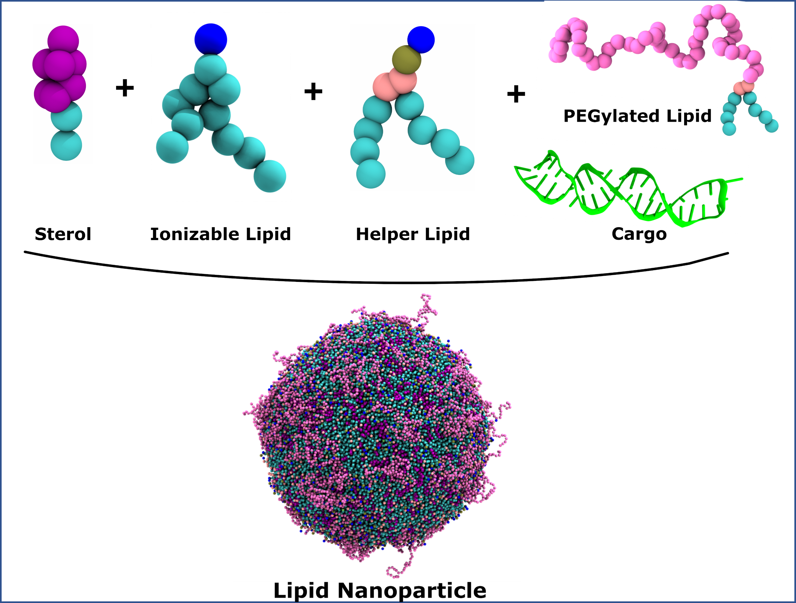

# Martini 3 Building Blocks for Lipid Nanoparticle Design
 

Welcome to the repository for **Martini 3 ionizable lipid parameters and protocols** tailored for the design and simulation of Lipid Nanoparticles (LNPs). These resources are designed to facilitate molecular dynamics simulations, enabling deeper insights into LNP formulation and function, particularly for pharmaceutical applications such as mRNA delivery.

## What’s Included
This repository provides:

1. **Ionizable Lipid Parameters:**  
   - Access the `Lipid_parameters` folder for ready-to-use Martini 3 parameters for:
      - Literature known Ionizable Lipids - `Lipid_parameters > Literature_known_lipids`;
      - Pre-built Ionizable Lipids - `Lipid_parameters > Ionizable_lipid_library`;
      - Ionizable Lipid Fragments - `Lipid_parameters > Fragments`.  
   - Detailed descriptions on how to generate new lipid itps are provided in `Lipid_parameters > Scripts`.  

2. **Case Studies and Protocols:**  
   - Explore the `Case_studies` folder to obtain the protocols that guide you through:
      - Building Lipid Nanoparticles - `Case_studies > Lipid_Nanoparticle_construction`
      - Quantifying stalk formation - `Case_studies > Quantifying_stalk_formation`
      - Simulating Unbiased Fusion - `Case_studies > Unbiased_Fusion`   
       

## Citation
If you use the parameters or protocols from this repository, please cite the following publication:  
[Kjølbye, L. R., Valério, M., Paloncýová, M., Borges-Araújo, L., Pestana-Nobles, R., Grünewald, F., ... & Souza, P. C. (2024). Martini 3 building blocks for Lipid Nanoparticle design.](https://doi.org/10.26434/chemrxiv-2024-bf4n8)
